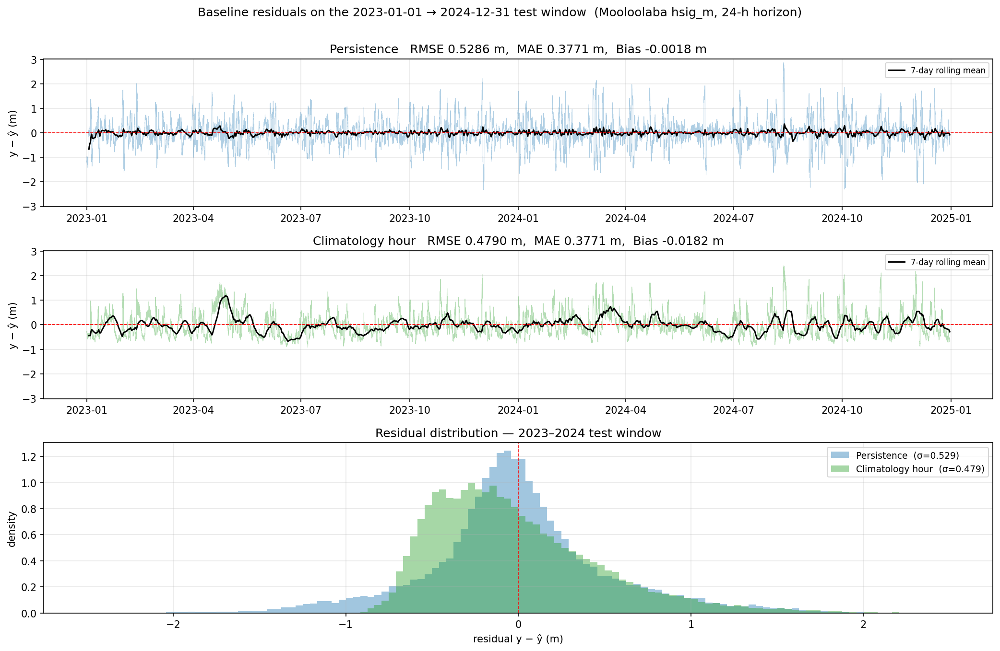
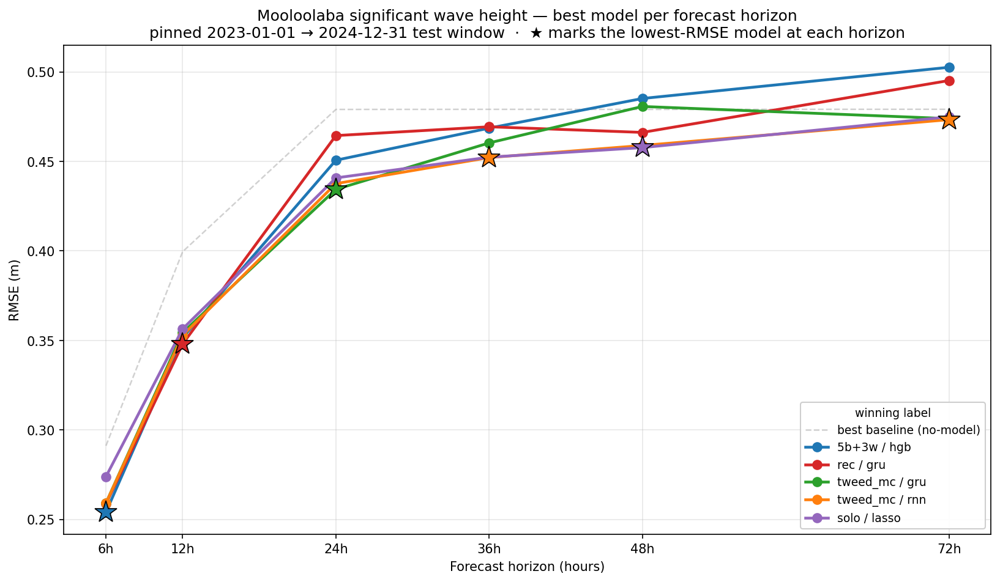

# Surf Height Prediction 2

An exercise in predictive modeling, this project is all about forecasting significant wave height (`hsig_m`) as measured by the Mooloolaba wave buoy off the sunny coast in Queensland, Australia.


## Objective

Given observations up to time *t* (30-minute cadence), predict `hsig_m` at *t + 6h, 12h, 24h, 36h, 48h, 72h*.

Evaluation uses a chronological 80/20 split with a pinned 2023-01-01 → 2024-12-31 test window. The headline metric is RMSE in meters and compared against two non-model predictive .

## Data source

All data in this project comes from the [Queensland Government open data portal](https://www.data.qld.gov.au/organization/environment-tourism-science-and-innovation), which provides us with several wind and wave monitoring stations in the region. Since all raw records are AEST we don't have to worry about time changes, and every output unified CSV carries a gap-free Brisbane `datetime` index.

### Upstream revisions

The QLD portal publishes these as *derived, delayed-mode* wave parameters, and it periodically re-derives and republishes whole yearly resource files. Comparing an October 2025 snapshot against a re-download confirmed this: of ~178k shared timestamps, **26.9% changed**, with a clear signature rather than random drift. No revision notice is published, so the behaviour is documented here.

- **Whole records are recomputed, not just `hsig_m`.** `hmax_m`, `tz_s`, `tp_s`, and `peak_dir_deg` all change on the same ~27% of rows (`sst_c` on ~26%) — the buoy spectra were reprocessed, not patched.
- **The change is symmetric.** New values are higher 50.3% / lower 49.7% of the time (mean Δ ≈ 0, -0.011 m) and the maximum is unchanged (5.204 m), so it is not a clipping, units, or one-sided shift — but magnitudes are large (median |Δ| = 0.42 m).
- **Revisions are temporally clustered, not periodic.** They form 195 contiguous blocks (median ~5 days, max 18), never scattered single points, with no time-of-day pattern.
- **They concentrate in big seas.** Waves >3 m were revised 40% of the time (mean |Δ| 0.63 m) vs ~25% / 0.11 m for 0.5-1.5 m waves, and the largest blocks all fall in the Dec–Mar storm/cyclone season (e.g. 2025-01-27→02-15, 2023-12-01→12-11).
- **Three years are untouched.** 2017, 2018, and 2021 are byte-identical; 2015/16/19/20/22/23/24/25 were republished.

The net effect is that the revised data is rougher:
- 12h autocorrelation dropped 0.85 → 0.74
- persistence RMSE rose from 26.5 cm on the old snapshot to ~40 cm now.

I assume the revision is a data-quality improvement (more accurate storm-period measurements), not a regression — but it means **absolute RMSE is not comparable across snapshots**, while skill-vs-persistence is largely preserved. `test_persistence_baseline_matches_documented_values` pins the current baseline so a future revision is caught rather than silently shifting the headline numbers.


### Wave buoy network

30-minute cadence. Mooloolaba is the prediction target; Brisbane, Caloundra, Gold Coast, North Moreton Bay, Palm Beach, Tweed Heads, and Wide Bay feed in as neighbour-buoy features where their histories overlap. Missing or erroneous readings (`-99.9` in the raw files) are replaced with `NaN`.

| Column | Description |
|--------|-------------|
| `hsig_m` | Significant wave height (meters) |
| `hmax_m` | Maximum wave height (meters) |
| `tz_s` | Zero-crossing period (seconds) |
| `tp_s` | Peak period (seconds) |
| `peak_dir_deg` | Peak wave direction (degrees) |
| `sst_c` | Sea surface temperature (°C) |


### Wind (air-quality monitoring network)

Hourly cadence, 10 m ultrasonic wind sensors on the QLD air-quality monitoring stations. Mountain Creek pairs with the Mooloolaba buoy, Deception Bay sits ~50 km south on Moreton Bay, Lytton is at the mouth of the Brisbane River (paired with the Brisbane buoy), and Southport sits on the Gold Coast (paired with the Gold Coast / Palm Beach buoys). Pollutant and temperature fields are dropped at clean time, leaving:

| Column | Description |
|--------|-------------|
| `wind_dir_deg` | Wind direction (degrees true north) |
| `wind_speed_ms` | Wind speed (meters/second) |
| `wind_sigma_theta_deg` | Wind direction standard deviation (degrees) |
| `wind_speed_std_ms` | Wind speed standard deviation (meters/second) |

The wind frame is reindexed onto the 30-minute wave grid by forward-fill.


### Dataset selection: length vs breadth

The coverage grids define the trade space for any experiment. The choice is a breadth-vs-depth call across two axes — how far back to train, and how many neighbour sources to include. Palm Beach (deployed 2017), Southport wind (mid-2018), and Wide Bay (2019, the only buoy upstream of northerly swells) only appear later.

## Data preparation

### Feature engineering

The feature matrix is assembled in three layers, each a single call:

1. **Base primary-buoy matrix** (`fc.build_buoy_features`) — circular encoding, hour/doy time features, lags, rolling stats, momentum. Lag/rolling/delta grids are tunable via `FeatureConfig`. For sequence models, `fc.build_seq_features` swaps in raw channels with no pre-built lags (the model windows its own input).
2. **Neighbour buoys** (`fc.add_neighbour_features`) — raw value, lag copies, and rolling mean/std per neighbour column, reusing the same `FeatureConfig`.
3. **Wind stations** — same `add_neighbour_features` call on each wind station's columns. `fc.load_wind` sin/cos-encodes `wind_dir_deg` and station-prefixes every column so cross-station features stay distinguishable.

### Preprocessing pipeline

`forecast.preprocess.Preprocessor` bundles the three steps the playgrounds run between `chronological_split` and `model.fit`:

1. **Drop sparse columns** — any column whose **train-set** NaN fraction exceeds `max_nan_frac` (default 0.5) is removed. Mean-imputing a near-empty column gives a near-constant feature that silently corrodes gradient-based sequence models (see the dropped-column note under Results for a concrete TCN example). The `wave_column_coverage.png` and `wind_column_coverage.png` EDA figures surface candidates ahead of time.
2. **Mean impute** — column-wise mean from training data fills remaining NaNs.
3. **Scale** (optional) — `"robust"` (median/IQR) or `"standard"`. Linear models default to robust because wave data is heavy-tailed and storm spikes would inflate a standard-deviation scale. Trees (HGB) take the raw matrix. Sequence models scale internally (`scaler="robust"` or `"standard"`, fit on train) and consume the unscaled `build_seq_features` frame. `*_sin`/`*_cos` columns pass through untouched in all cases.


## Non-model baselines

Two no-model references frame every result in this project:

- **Persistence** — predict ŷ(t+h) = y(t). Strong at short horizons because Mooloolaba's `hsig_m` is highly autocorrelated on the order of hours, so "looks like now" is hard to beat in the first half-day.
- **Climatology hour** — predict the train-set mean of `hsig_m` conditioned on hour-of-day(t+h). Horizon-independent: it ignores `t` entirely, so its RMSE is flat at ~0.48 m across every horizon.

The two crossover between **h=12 and h=24** on the pinned 2023-01-01 → 2024-12-31 test window — persistence wins for h≤12, climatology from h≥24 onward:

| h | Persistence RMSE (m) | Climatology hour RMSE (m) | Better |
|---|---|---|---|
| 6h  | 0.291 | 0.479 | persistence |
| 12h | 0.400 | 0.479 | persistence |
| 24h | 0.529 | 0.479 | **climatology** |
| 36h | 0.562 | 0.479 | climatology |
| 48h | 0.574 | 0.479 | climatology |
| 72h | 0.624 | 0.479 | climatology |

Residual diagnostics at the crossover horizon (h=24) show *why* climatology is the harder reference past this point — persistence error is roughly symmetric noise (it just doesn't know what wave height looks like a day out) while climatology has a tighter core but a left-skewed tail, systematically under-predicting the biggest swells.



## Feature ablation

Before tuning hyperparameters it's worth knowing *which* wind and wave stations are actually paying their way at each horizon, per model family. `notebooks/feature_ablation.py` answers that with two complementary measurements:

- **Add-one** — start from the primary buoy alone (the "baseline" run) and add a single station; measure RMSE delta. Captures the marginal value of a station in the absence of the others.
- **Drop-one** — start from every station available (the "ceiling" run) and remove a single station; measure RMSE delta. Captures the marginal cost when other context is already present.

The two disagree under redundancy and complementarity, which is the point of running both. Every cell uses the **same fixed window** — clipped once to the all-station overlap (2019-01-08 → 2024-12-09, ~104k rows) so that adding or dropping a station changes only the column set, not the training rows. The pinned 2023-01-01 test cutoff matches the horizon-sweep convention. Ridge (α=1) and HGB-on-residual (`max_iter=800`, `lr=0.03`, `depth=6`) share the same feature build and grid; the GRU pass uses the best baseline-combo seq config from the sequence sweep.

A station is **kept** for `(horizon, family)` when EITHER add-one improves baseline by ≥ 0.5% RMSE, OR drop-one worsens ceiling by ≥ 0.5%. Inclusive on disagreement.

### Anchors: baseline vs ceiling per (horizon, family)

The ceiling-vs-baseline gap is by itself the headline result — it tells you whether throwing every station at this horizon is even worth attempting.

| horizon | family | baseline RMSE | ceiling RMSE | gap (ceil vs base) |
|---:|:---|---:|---:|---:|
| 6h  | Ridge | 0.2702 | 0.2603 | **+3.66%** |
| 6h  | HGB   | 0.2651 | 0.2599 | **+1.97%** |
| 6h  | GRU   | 0.2720 | 0.2589 | **+4.80%** |
| 12h | Ridge | 0.3556 | 0.3482 | **+2.09%** |
| 12h | HGB   | 0.3611 | 0.3624 | −0.35% |
| 12h | GRU   | 0.3585 | 0.3561 | +0.66% |
| 24h | Ridge | 0.4452 | 0.4475 | −0.52% |
| 24h | HGB   | 0.4542 | 0.4629 | −1.91% |
| 24h | GRU   | 0.4542 | 0.4627 | −1.88% |
| 36h | Ridge | 0.4570 | 0.4612 | −0.92% |
| 36h | HGB   | 0.4760 | 0.4940 | −3.78% |
| 36h | GRU   | 0.4614 | 0.4726 | −2.42% |
| 48h | Ridge | 0.4629 | 0.4699 | −1.53% |
| 48h | HGB   | 0.4978 | 0.5091 | −2.28% |
| 48h | GRU   | 0.4728 | 0.4890 | −3.41% |
| 72h | Ridge | 0.4860 | 0.4928 | −1.41% |
| 72h | HGB   | 0.5252 | 0.5441 | −3.60% |
| 72h | GRU   | 0.4926 | 0.5267 | **−6.92%** |

Read the sign of the gap: positive = the all-stations ceiling beats the primary-only baseline; negative = the ceiling is *worse* than primary-only. **The ceiling stops paying off past h=12 for all three families** — at long horizons feeding every station to the same model makes it worse, not better, because the extra columns are mostly noise the regulariser then has to absorb. The damage is most extreme for GRU (−6.9% at h=72), suggesting the sequence model's capacity is being burned on noise channels it can't filter out the way the linear and tree models do.

### Heatmaps

Both panels are signed so that **positive = "this station is contributing"**. Add panels plot RMSE % *gain* vs the primary-only baseline (so positive means adding the station lowered RMSE). Drop panels plot RMSE % *cost* vs the full ceiling (positive means removing the station raised RMSE — i.e. it was carrying weight).


### Recommended station set per (horizon, family)

| horizon | Ridge | HGB | GRU |
|---:|---|---|---|
| 6h  | brisbane, deception-bay, gold-coast, mountain-creek, palm-beach, southport, tweed-heads | brisbane, caloundra, deception-bay, gold-coast, lytton, mountain-creek, north-moreton-bay, palm-beach, southport, tweed-heads | every station (all 11) |
| 12h | brisbane, gold-coast, mountain-creek, palm-beach, southport, tweed-heads | deception-bay, gold-coast, lytton, mountain-creek, palm-beach, southport, tweed-heads | deception-bay, gold-coast, lytton, mountain-creek, southport |
| 24h | wide-bay | brisbane, caloundra, deception-bay, lytton, north-moreton-bay, palm-beach, tweed-heads | brisbane, caloundra, gold-coast, lytton, mountain-creek, north-moreton-bay, palm-beach, tweed-heads, wide-bay |
| 36h | (none — primary buoy alone) | deception-bay, gold-coast, southport | brisbane, caloundra, gold-coast, north-moreton-bay, palm-beach, tweed-heads, wide-bay |
| 48h | (none — primary buoy alone) | gold-coast, mountain-creek, palm-beach | brisbane, caloundra, gold-coast, north-moreton-bay, palm-beach, tweed-heads |
| 72h | (none — primary buoy alone) | brisbane, gold-coast, lytton, mountain-creek, palm-beach, tweed-heads | brisbane, caloundra, gold-coast, mountain-creek, north-moreton-bay, palm-beach, tweed-heads, wide-bay |

Four patterns are worth absorbing before the tuning section:

- **Same horizon, different feature set per family — strongly.** At h=24 Ridge keeps just one buoy (wide-bay), HGB wants seven, and GRU wants nine. Ridge's signal sits in a small low-variance subspace; HGB extracts non-linear value from stations Ridge happily discards; GRU exploits the *temporal* structure of nearly every wave neighbour. This is exactly why we settled on "one recommended set per (horizon, model family)" rather than a single fixed set.
- **Short-horizon: more is more; long-horizon: depends on the family.** At h=6/12 every family picks a wide set and the ceiling wins outright. Past h=24 the all-stations ceiling is *worse* than the primary-only baseline by 1–7% across families — but for Ridge that means "use the primary buoy alone", while for HGB and especially GRU a *subset* of stations still beats both anchors. The drop-one signal reveals which subset.
- **GRU wants wave neighbours, never wind.** The drop-one heatmap is unambiguous: at h≥24 every wave neighbour is positive (removing it hurts), while the four wind stations are uniformly negative (removing them helps). At h=72 tweed-heads alone has a +12% drop-cost. The sequence model is exploiting the cross-buoy autocorrelated swell signal and being actively confused by the noisier sub-daily wind channels.
- **A few stations are systematically valuable, a few never are.** Brisbane, Gold Coast, Tweed Heads, and Palm Beach clear the 0.5% bar in most family/horizon cells. Caloundra and North Moreton Bay almost never do for Ridge or HGB — they're geographically closest to Mooloolaba, but their `hsig_m` series are too redundant with the primary buoy to add information for the engineered-feature models. GRU rescues them at long horizons because the raw time-series carries phase information the engineered features have averaged out.

The next section locks in these station sets and tunes hyperparameters within them.

## Model selection and tuning

Models are evaluated across six forecast horizons (6h → 72h) on the pinned 2023-01-01 → 2024-12-31 test window. The figure below shows the lowest-RMSE single (non-ensemble) model at each horizon; every line is a (dataset, architecture) combo that won at least one horizon, with stars marking its winning horizons. The "best baseline" backdrop is the lower envelope of persistence and climatology — see *Non-model baselines* above for the per-horizon breakdown.



Numbers behind the chart:

| h | Better baseline RMSE (m) | Best single model | RMSE (m) | Skill vs better baseline | Best ensemble | RMSE (m) | Skill vs better baseline |
|---|---|---|---|---|---|---|---|
| 6h  | 0.291 (persistence) | 5b+3w / HGB-on-residual | 0.254 | +0.127 | **rec ensemble** | **0.254** | **+0.128** |
| 12h | 0.400 (persistence) | **rec / GRU** | **0.348** | **+0.130** | **rec ensemble** | **0.342** | **+0.145** |
| 24h | 0.479 (climatology) | tweed_mc / GRU | 0.434 | +0.094 | tweed_mc ensemble | 0.431 | +0.100 |
| 36h | 0.479 (climatology) | tweed_mc / RNN | 0.452 | +0.056 | solo ensemble | 0.449 | +0.063 |
| 48h | 0.479 (climatology) | solo / Lasso | 0.458 | +0.044 | **rec ensemble** | **0.458** | **+0.044** |
| 72h | 0.479 (climatology) | tweed_mc / RNN | 0.473 | +0.013 | 5b+3w ensemble | 0.477 | +0.004 |

The combo shorthand: `solo` = primary buoy only; `tweed_mc` = primary + Tweed Heads + Mountain Creek wind; `5b+3w` = primary + 5 wave neighbours + 3 wind stations; `wide` = primary + 7 neighbours + 4 wind stations on the shorter 2019-2024 window; `rec` = each family fit on its own ablation-recommended station set (see *Feature ablation*).

Bold rows are picks newly added by the recommended-set search (`notebooks/recommended_sweep.py`). They displace the prior winners at h=6 (ensemble) and h=12 (both single and ensemble) and tie at h=48 (ensemble). At h=24/36/72 the prior `tweed_mc` / `solo` / `5b+3w` picks still win because they trained on the longer 2015-2024 window; the recommended-set search is locked to the ablation's 2019-2024 fixed window.

### Linear models (h=12 deep dive)

Nine configs were swept through `notebooks/linear_playground.py`, all at h=12 — the original prediction target before the horizon sweep. The cross-horizon view is the chart above; this section drills into how source breadth and regularisation interact when persistence is still the harder reference. All scored on the same pinned test window (2023-01-01 → 2024-12-31 AEST) so RMSE is directly comparable. Each config runs Ridge (α=1), Lasso (α=0.001), HGB-on-residuals (`max_iter=800`, `lr=0.03`, `depth=6`), and a nanmean ensemble of the three. Persistence on the shared window is **RMSE 0.3996 m** (39.96 cm).

| Config | Window | Sources | Feats | Best member | Ensemble RMSE (m) | Skill vs persistence |
|---|---|---|---|---|---|---|
| **v2 wide** | 2019–2024 | 7 buoys + 4 wind | 406 | Lasso 0.3481 | **0.3436** | **+0.2610** |
| v6 ridgehi (α=10 / α=5e-4) | 2015–2024 | 5 buoys + 3 wind | 328 | HGB 0.3470 | 0.3439 | +0.2598 |
| v1 baseline | 2015–2024 | 5 buoys + 3 wind | 328 | HGB 0.3470 | 0.3441 | +0.2590 |
| v9 tweed + mc-wind | 2015–2024 | tweed-heads + mountain-creek wind | 172 | HGB 0.3470 | 0.3446 | +0.2567 |
| v3 no-wind | 2015–2024 | 5 buoys, no wind | 172 | HGB 0.3477 | 0.3446 | +0.2566 |
| v5 dense lags | 2015–2024 | 5 buoys + 3 wind | 433 | HGB 0.3488 | 0.3452 | +0.2542 |
| v7 HGB-heavy alone | 2015–2024 | 5 buoys + 3 wind | 328 | HGB 0.3469 | — | +0.2460 |
| v8 mc-wind only | 2015–2024 | mooloolaba + mountain-creek wind | 159 | HGB 0.3500 | 0.3475 | +0.2443 |
| v4 solo (no neighbours, no wind) | 2015–2024 | mooloolaba only | 107 | HGB 0.3527 | 0.3490 | +0.2379 |

The headline takeaway is that **every reasonable config lands inside a ~5 mm RMSE band** (0.3436–0.3490) — the model family, regularisation strength, and feature grid all matter less than which external sources are in the feature matrix. Concretely:

- **One upstream buoy carries almost all the neighbour signal.** v9 (Tweed Heads + Mountain Creek wind, 1 buoy + 1 wind) hits ensemble RMSE 0.3446 — bit-for-bit tied with v3 (5 buoys, no wind, also 0.3446) and within 1 mm of v1 (5 buoys + 3 wind, 0.3441). Tweed Heads is ~100 km south of Mooloolaba and sees southerly swells first; once you have it, Brisbane / Caloundra / Gold Coast / North Moreton Bay add nothing measurable.
- **The source ladder is steep then flat.** Mooloolaba alone (v4) 0.3490 → add Mountain Creek wind (v8) 0.3475 (−1.5 mm) → add Tweed Heads buoy (v9) 0.3446 (−2.9 mm) → add 4 more neighbour buoys + 2 more wind stations (v1) 0.3441 (−0.5 mm). The first two sources beyond the primary buoy do almost all the work.
- **Wide window helps the ensemble, marginally.** v2 (2019-2024, 7 buoys + 4 wind) edges out v1 by 0.5 mm, despite halving the training set — the two extra neighbour buoys (Palm Beach, Wide Bay) and Southport wind compensate.
- **The default feature grid is already near-optimal.** v5 doubles the lag/rolling/momentum density and gets *worse* by 1.1 mm — the marginal columns are noise the linear models then have to regularise away.
- **The ensemble is the right shipping artefact.** Every config's ensemble beats every individual member in it, even though the members are highly correlated. With three near-equally-good models there's no Bayesian-averaging dilemma: the nanmean costs nothing and shaves another 0.3–0.5 cm.
- **HGB-on-residuals is the strongest single model**, modestly ahead of Ridge and Lasso across configs. Direct-target HGB (run separately in v7-style trials) is consistently worse, which matches the priors — letting persistence handle the level and giving HGB only the delta is a meaningfully easier learning problem.

For full per-model rows including MAE and bias, see `experiments.jsonl` (filter on `name` starting with `lineopt_v`).

## Real world performance

Each new year that passes can be scored as a true blind set against our best models. This way we evaluate them against brand new data that wasn't implicitly leaked through the train/test iterative process. Awaiting the QLD wind 2025 release expected September 2026.

**Pre-committed candidates for 2025**:

- TBD
- TBD
- **TBD Ensemble**

Scoring a new year against these committed candidates is a re-fit of the same recipe on the same training data, not a load of a serialised model. The `Preprocessor` fitted alongside each model captures the drop list, imputer means, and scaler stats, so the held-out year sees the same transformation the model was trained against — including any schema drift (extra columns are dropped, missing required columns raise).

| Year | h | Model | RMSE (cm) | Skill |
|------|---|-------|-----------|-------|
| 2025 | 12h | Ridge | _TBD_ | _TBD_ |
| 2025 | 12h | TCN | _TBD_ | _TBD_ |
| 2025 | 12h | Ensemble | _TBD_ | _TBD_ |
| 2025 | 24h | Ridge | _TBD_ | _TBD_ |
| 2025 | 24h | TCN | _TBD_ | _TBD_ |
| 2025 | 24h | Ensemble | _TBD_ | _TBD_ |
| 2025 | 48h | Ridge | _TBD_ | _TBD_ |
| 2025 | 48h | TCN | _TBD_ | _TBD_ |
| 2025 | 48h | Ensemble | _TBD_ | _TBD_ |


## Reproducibility

### Setup

With [uv](https://docs.astral.sh/uv/) installed:

```bash
uv sync --all-extras
```

Run tests after changes:

```bash
./.venv/bin/pytest src/tests/ -v
```

### Packages

- **`qld_ckan`**: Downloads yearly records from the QLD CKAN Datastore API, unifies the schema, and writes a cleaned CSV per source.
    - `qld_ckan.wave` (wave buoys) 
    - `qld_ckan.wind` (air-quality-station 10 m wind)
- **`viz`**: Source-agnostic plotting, organised by pipeline stage: shared time-series primitives, post-download EDA heatmaps, and post-experiment result charts that consume `forecast.find_runs` output.
- **`forecast`**: Target construction, chronological splits, feature engineering, baselines, metrics, and an evaluation harness. See *Available forecasters* below for the model list.

Experiment scripts in `notebooks/` run on top of these packages.

### Running the pipeline

Generate `data/` with these commands (one CSV per source):

```bash
# Wave - default Mooloolaba 2015-2025
./.venv/bin/python -m qld_ckan wave [--buoy brisbane|caloundra|gold-coast|north-moreton-bay|palm-beach|tweed-heads|wide-bay]

# Wind - default Mountain Creek 2010-2024
./.venv/bin/python -m qld_ckan wind [--station deception-bay|lytton|southport]
```

Both subcommands accept `--year-min` / `--year-max` (inclusive) to clip the registry before download.

```bash
./.venv/bin/python -m qld_ckan wave --buoy brisbane --year-min 2018 --year-max 2020
```

The standalone helpers (`fc.drop_sparse_columns`, `fc.mean_impute`, `fc.scale_features`) still exist for one-shot use, but the playgrounds use the class so the fitted state can be inspected, asserted, and pickled:

```python
preproc = fc.Preprocessor(max_nan_frac=0.5, scaling="robust").fit(X_train)
X_train_p = preproc.transform(X_train)
X_test_p  = preproc.transform(X_test)

# Held-out year scoring: pair the model with its preprocessor.
preproc.save("models/ridge_preproc.pkl")
# Later, with a new year's raw inputs:
preproc = fc.Preprocessor.load("models/ridge_preproc.pkl")
X_2025_p = preproc.transform(X_2025)  # raises if any fit-time column is missing
```

`transform()` enforces the schema the preprocessor was fitted on: any missing required column raises `ValueError`; extra columns (e.g. a new wind station appearing later) are silently dropped. This catches the failure mode where a held-out year's feature matrix doesn't line up with the training-time decisions — without the class, that mismatch would surface as a silently wrong prediction.

`forecast` exposes a flat import surface (`import forecast as fc`): target construction (`make_target` shifts `hsig_m` 24 steps ahead), chronological 80/20 split, feature builders, and an `evaluate_and_log` harness that scores `MAE / RMSE / Bias / SkillVsBaseline` against persistence and appends to `experiments.jsonl`. A typical call:

```python
result = fc.evaluate_and_log(
    fc.Ridge(alpha=1.0), X_tr, y_tr, X_te, y_te,
    name="ridge", data_sources=["mooloolaba"],
)
print(result.metrics)
```

### Available forecasters

| family          | classes                                                                         |
|-----------------|---------------------------------------------------------------------------------|
| baselines       | `PersistenceForecaster`, `ClimatologyHourForecaster` |
| linear / tree   | any scikit-learn regressor (Ridge, Lasso, HGB, …)                               |
| sequence models | `SimpleRNNForecaster`, `GRUForecaster`, `LSTMForecaster`, `TCNForecaster`       |

### Logging experiments

`fc.evaluate_and_log(...)` is a drop-in for `fc.evaluate(...)` that appends a record to `experiments.jsonl` (committed at repo root); `fc.log_run(result, ...)` covers results computed outside the harness. Read the log back as a DataFrame with `fc.read_log()`.

### Experiment scripts

All scripts are plain `.py` files — run directly:

```bash
./.venv/bin/python notebooks/<script>.py
```


## Roadmap / Expansions

1. **Predict quantiles, not just the mean.** Quantile HGB (`HistGradientBoostingRegressor(loss="quantile", quantile=q)`) for P10/P50/P90, or conformalised intervals over Ridge. Also the structural fix for the tail underfit — residuals-vs-predicted shows bias at high wave heights that pinball loss addresses and a target transform won't.

2. **Multi-output forecasts.** 2 m at 90°/14 s breaks differently from 2 m at 150°/8 s. Forecast `tp_s` and `peak_dir_deg` jointly (`MultiOutputRegressor`) so downstream code can apply break-specific transforms.

3. **Long-cadence historical bundles.** Deeper wave history for swell-upstream buoys: Mooloolaba 2000-2014 (1h), Brisbane 1976-2011 (12h), Gold Coast 1987-2014 (6h), Tweed Heads 1995-2011 (1h). Excluded from `qld_ckan.wave.constants.BUOYS` because the pipeline assumes a 30-min axis and these have drifting minute offsets (e.g. 08:55, 14:56). Needs: a cadence parameter on the wave pipeline, snap-to-grid (floor + dedup) before reindex, and a join strategy mixing coarse history with the 30-min grid. Resource IDs at `coastal-data-system-waves-{slug}` on `data.qld.gov.au`. QLD's 1989-1992 DST window forces choosing fixed UTC+10 (`Etc/GMT-10`) or per-row DST.