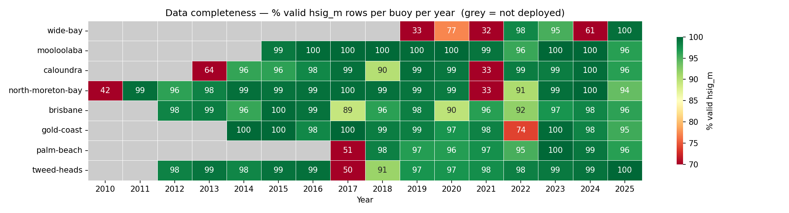
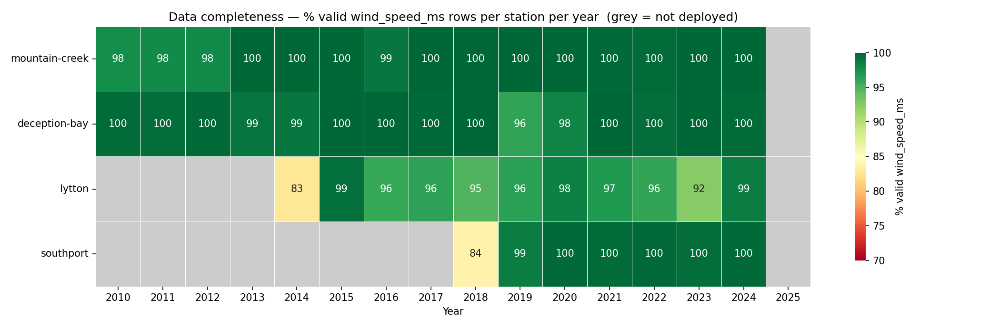

# Surf Height Prediction 2

An exercise in predictive modeling, this project is all about forecasting significant wave height (`hsig_m`) as measured by the Mooloolaba wave buoy off the sunny coast in Queensland, Australia.


## Objective

Given observations up to time *t* (30-minute cadence), predict `hsig_m` at *t + 6h, 12h, 24h, 36h, 48h, 72h*.


## Data source

All data in this project comes from the [Queensland Government open data portal](https://www.data.qld.gov.au/organization/environment-tourism-science-and-innovation), which provides us with several wind and wave monitoring stations in the region. Since all raw records are AEST we don't have to worry about time changes, and every output unified CSV carries a gap-free Brisbane `datetime` index.

### Upstream revisions

The QLD portal publishes these as *derived, delayed-mode* wave parameters, and it periodically re-derives and republishes whole yearly resource files. Comparing an October 2025 snapshot against a re-download confirmed this: of ~178k shared timestamps, **26.9% changed**, with a clear signature rather than random drift. No revision notice is published, so the behaviour is documented here.

- **Whole records are recomputed, not just `hsig_m`.** `hmax_m`, `tz_s`, `tp_s`, and `peak_dir_deg` all change on the same ~27% of rows (`sst_c` on ~26%) — the buoy spectra were reprocessed, not patched.
- **The change is symmetric.** New values are higher 50.3% / lower 49.7% of the time (mean Δ ≈ 0, -0.011 m) and the maximum is unchanged (5.204 m), so it is not a clipping, units, or one-sided shift — but magnitudes are large (median |Δ| = 0.42 m).
- **Revisions are temporally clustered, not periodic.** They form 195 contiguous blocks (median ~5 days, max 18), never scattered single points, with no time-of-day pattern.
- **They concentrate in big seas.** Waves >3 m were revised 40% of the time (mean |Δ| 0.63 m) vs ~25% / 0.11 m for 0.5-1.5 m waves, and the largest blocks all fall in the Dec–Mar storm/cyclone season (e.g. 2025-01-27→02-15, 2023-12-01→12-11).
- **Three years are untouched.** 2017, 2018, and 2021 are byte-identical; 2015/16/19/20/22/23/24/25 were republished.

The net effect is that the revised data is rougher:
- 12h autocorrelation dropped 0.85 → 0.74
- persistence RMSE rose from 26.5 cm on the old snapshot to ~40 cm now.

I assume the revision is a data-quality improvement (more accurate storm-period measurements), not a regression — but it means **absolute RMSE is not comparable across snapshots**, while skill-vs-persistence is largely preserved. `test_persistence_baseline_matches_documented_values` pins the current baseline so a future revision is caught rather than silently shifting the headline numbers.


### Wave buoy network

30-minute cadence. Mooloolaba is the prediction target; Brisbane, Caloundra, Gold Coast, North Moreton Bay, Palm Beach, Tweed Heads, and Wide Bay feed in as neighbour-buoy features where their histories overlap. Missing or erroneous readings (`-99.9` in the raw files) are replaced with `NaN`.

| Column | Description |
|--------|-------------|
| `hsig_m` | Significant wave height (meters) |
| `hmax_m` | Maximum wave height (meters) |
| `tz_s` | Zero-crossing period (seconds) |
| `tp_s` | Peak period (seconds) |
| `peak_dir_deg` | Peak wave direction (degrees) |
| `sst_c` | Sea surface temperature (°C) |



### Wind (air-quality monitoring network)

Hourly cadence, 10 m ultrasonic wind sensors on the QLD air-quality monitoring stations. Mountain Creek pairs with the Mooloolaba buoy, Deception Bay sits ~50 km south on Moreton Bay, Lytton is at the mouth of the Brisbane River (paired with the Brisbane buoy), and Southport sits on the Gold Coast (paired with the Gold Coast / Palm Beach buoys). Pollutant and temperature fields are dropped at clean time, leaving:

| Column | Description |
|--------|-------------|
| `wind_dir_deg` | Wind direction (degrees true north) |
| `wind_speed_ms` | Wind speed (meters/second) |
| `wind_sigma_theta_deg` | Wind direction standard deviation (degrees) |
| `wind_speed_std_ms` | Wind speed standard deviation (meters/second) |

The wind frame is reindexed onto the 30-minute wave grid by forward-fill.



## Modeling and Results

## Reproducibility

### Setup

With [uv](https://docs.astral.sh/uv/) installed:

```bash
uv sync --all-extras
```

Run tests after changes:

```bash
./.venv/bin/pytest src/tests/ -v
```

### Packages

- **`qld_ckan`**: Downloads yearly records from the QLD CKAN Datastore API, unifies the schema, and writes a cleaned CSV per source.
    - `qld_ckan.wave` (wave buoys) 
    - `qld_ckan.wind` (air-quality-station 10 m wind)
- **`viz`**: Source-agnostic plotting
- **`forecast`**: Target construction, chronological splits, leakage-safe feature engineering, baselines, metrics, rolling-origin backtesting with a block-bootstrap noise floor and paired-significance tests, an evaluation harness, and append-only experiment logging. See *Available forecasters* below for the model list.

Experiment scripts in `notebooks/` run on top of these packages.

### Running the pipeline

Generate `data/` with these commands (one CSV per source):

```bash
# Wave - default Mooloolaba 2015-2025
./.venv/bin/python -m qld_ckan wave [--buoy brisbane|caloundra|gold-coast|north-moreton-bay|palm-beach|tweed-heads|wide-bay]

# Wind - default Mountain Creek 2010-2024
./.venv/bin/python -m qld_ckan wind [--station deception-bay|lytton|southport]
```

Both subcommands accept `--year-min` / `--year-max` (inclusive) to clip the registry before download.

```bash
./.venv/bin/python -m qld_ckan wave --buoy brisbane --year-min 2018 --year-max 2020
```

### Available forecasters

| family     | classes                                                                              |
|------------|--------------------------------------------------------------------------------------|


### Logging experiments

`fc.evaluate_and_log(...)` is a drop-in for `fc.evaluate(...)` that appends a record to `experiments.jsonl` (committed at repo root); `fc.log_run(result, ...)` covers results computed outside the harness. Read the log back as a DataFrame with `fc.read_log()`.

### Experiment scripts

All scripts are plain `.py` files — run directly:

```bash
./.venv/bin/python notebooks/<script>.py
```

## Future Roadmap

1. **Predict quantiles, not just the mean.** Quantile HGB (`HistGradientBoostingRegressor(loss="quantile", quantile=q)`) for P10/P50/P90, or conformalised intervals over Ridge. Also the structural fix for the tail underfit — residuals-vs-predicted shows bias at high wave heights that pinball loss addresses and a target transform won't.

2. **Multi-output forecasts.** 2 m at 90°/14 s breaks differently from 2 m at 150°/8 s. Forecast `tp_s` and `peak_dir_deg` jointly (`MultiOutputRegressor`) so downstream code can apply break-specific transforms.

3. **Long-cadence historical bundles.** Deeper wave history for swell-upstream buoys: Mooloolaba 2000-2014 (1h), Brisbane 1976-2011 (12h), Gold Coast 1987-2014 (6h), Tweed Heads 1995-2011 (1h). Excluded from `qld_ckan.wave.constants.BUOYS` because the pipeline assumes a 30-min axis and these have drifting minute offsets (e.g. 08:55, 14:56). Needs: a cadence parameter on the wave pipeline, snap-to-grid (floor + dedup) before reindex, and a join strategy mixing coarse history with the 30-min grid. Resource IDs at `coastal-data-system-waves-{slug}` on `data.qld.gov.au`. QLD's 1989-1992 DST window forces choosing fixed UTC+10 (`Etc/GMT-10`) or per-row DST.